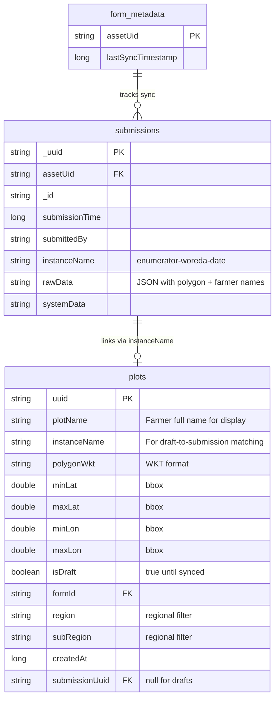
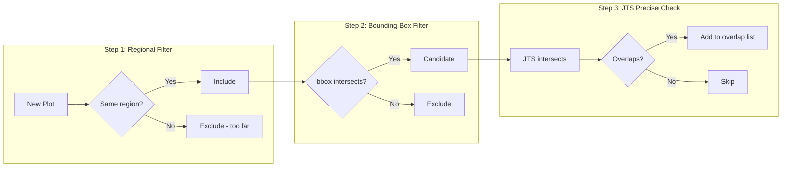
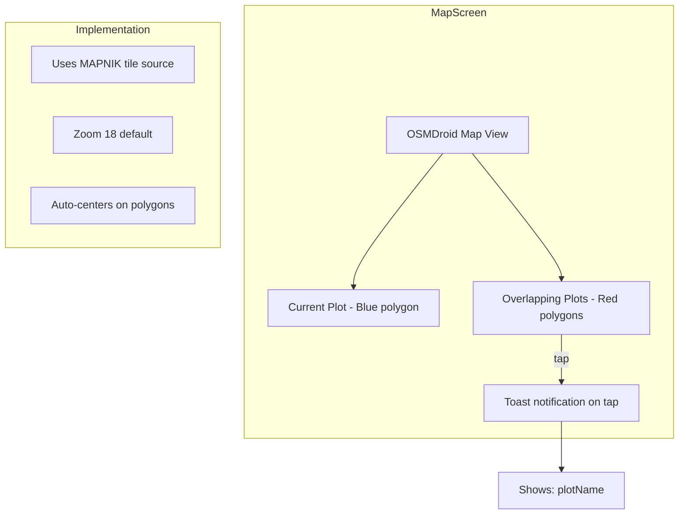

# Polygon Overlap Validation - Implementation Plan

## Existing Resources

| Component | Location | Purpose |
|-----------|----------|---------|
| `SubmissionEntity` | `data/entity/` | Stores submissions with `rawData` JSON + `instanceName` |
| `SubmissionDao` | `data/dao/` | Queries by assetUid, uuid |
| `PolygonValidator` | `validation/` | JTS validation (vertices, area, self-intersection) |
| `PolygonValidationActivity` | `validation/` | Intent receiver, returns "value" to Kobo |
| `KoboRepository` | `data/repository/` | Fetches/syncs submissions from Kobo API |

**Already integrated**: JTS library, Room, Hilt, Kobo API sync

---

## Entity Relationship Diagram



---

## Validation Flow


---

## Proximity Filtering Strategy



**Performance**: Plots in different regions are never checked. Bounding box reduces JTS checks to ~5-50 candidates even with 10,000 plots.

---

## Draft Lifecycle


**Match criteria**: `plots.instanceName` matches `submissions.instanceName`

---

## Intent Contract

### Current
```
appearance: ex:org.akvo.afribamodkvalidator.VALIDATE_POLYGON(shape=${Open_Area_GeoMapping})
```

### Required
```
appearance: ex:org.akvo.afribamodkvalidator.VALIDATE_POLYGON(
  shape=${Open_Area_GeoMapping},
  plot_name=${First_Name} ${Father_s_Name} ${Grandfather_s_Name},
  region=${woreda},
  sub_region=${kebele}
)
```

### XLSForm Settings (unchanged)
```
instance_name: concat(${enumerator_id}, '-', ${woreda}, '-', today())
```


---

## Map Visualization



---

## XLSForm Field Mapping

| XLSForm Field | Intent Extra | PlotEntity Field |
|---------------|--------------|------------------|
| `${First_Name} ${Father_s_Name} ${Grandfather_s_Name}` | `plot_name` | `plotName` |
| `meta/instanceName` | (from submission) | `instanceName` |
| `Open_Area_GeoMapping` or `manual_boundary` | `shape` | `polygonWkt` |
| `woreda` | `region` | `region` |
| `kebele` | `sub_region` | `subRegion` |

**rawData fields for sync extraction**:
- Polygon: `Open_Area_GeoMapping` (geotrace) or `manual_boundary` (geoshape)
- Farmer name: `First_Name`, `Father_s_Name`, `Grandfather_s_Name`

---

## Implementation Phases

### Phase 1: Data Layer
- [ ] Create `PlotEntity` with plotName, instanceName, bbox, regional columns
- [ ] Create `PlotDao` with proximity query
- [ ] Update `AppDatabase` to version 3
- [ ] Add `PlotDao` to `DatabaseModule`

### Phase 2: Overlap Detection
- [ ] Add `OverlapChecker` class using JTS
- [ ] Implement bbox computation from polygon
- [ ] Proximity filter: region + bbox pre-filter
- [ ] JTS `intersects()` for precise check

### Phase 3: Activity Integration
- [ ] Update `PolygonValidationActivity` for Hilt injection
- [ ] Parse intent extras (shape, plot_name, region, sub_region)
- [ ] Save draft plot on validation launch
- [ ] Format error message with plotName

### Phase 4: Map Visualization (MVP Required)
- [x] Integrate OSMDroid (replaced Mapbox for simplicity)
- [x] Display current polygon (blue) + overlapping polygons (red)
- [x] Toast notification with plotName on tap
- [ ] Offline tile caching (future enhancement)

### Phase 5: Draft Sync
- [ ] Match drafts to submissions by instanceName after sync
- [ ] Update `isDraft` = false on match
- [ ] Extract plots from synced rawData (polygon + farmer name fields)

### Phase 6: XLSForm Update
- [ ] Update intent appearance to pass plot_name, region, sub_region
- [ ] Test with updated form

---

## Error Message Format

Per AC:
```
New plot for <plotName> overlaps with plot for <plotName>
```

Example:
```
New plot for Abebe Kebede Tadesse overlaps with plot for Girma Tesfaye Hailu
```

---

## SQL Queries

### Proximity + Bounding Box Query
```sql
SELECT * FROM plots
WHERE uuid != :excludeUuid
  AND region = :region
  AND minLat <= :newMaxLat
  AND maxLat >= :newMinLat
  AND minLon <= :newMaxLon
  AND maxLon >= :newMinLon
```

### Match Draft to Submission
```sql
UPDATE plots
SET isDraft = 0, submissionUuid = :uuid
WHERE instanceName = :instanceName
  AND isDraft = 1
```

---

## Dependencies

**Already have:**
- `org.locationtech.jts:jts-core`

**Need to add:**
- `org.osmdroid:osmdroid-android:6.1.18` (for map visualization) ✅ Added
